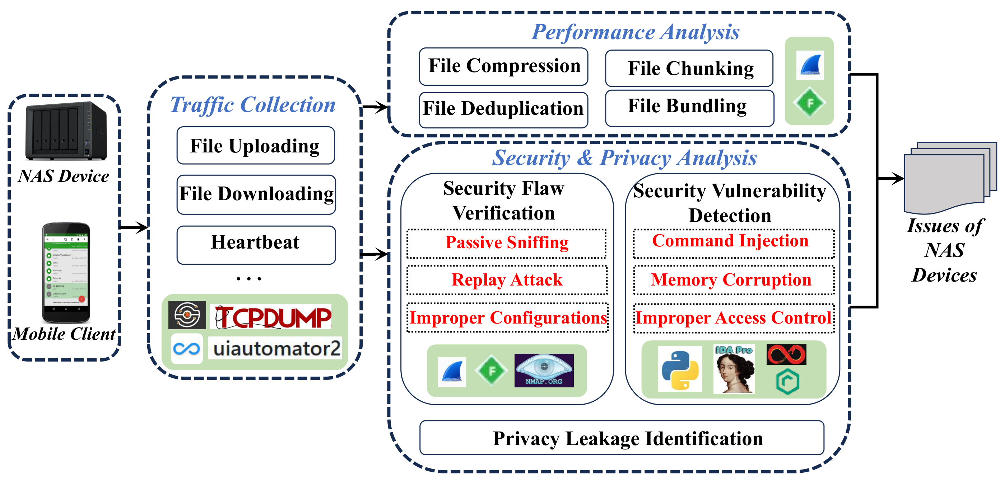

# NASchecker: Automatically Identifying the Performance, Security, and Privacy Issues of NAS Devices

[](https://doi.org/10.1109/JIOT.2026.3686461)
[](LICENSE)
[](CVEs.md)

**Paper:** Guangyue Ren, Jincheng Wang, Le Yu\*, Liping Han, Mingzhe Hu, Wei Chen, Tingting Liu, Xiapu Luo, Guozi Sun\*

**Published in:** IEEE Internet of Things Journal (2026) | DOI: [10.1109/JIOT.2026.3686461](https://doi.org/10.1109/JIOT.2026.3686461)

> \*Corresponding authors: Le Yu (yulele08@njupt.edu.cn) and Guozi Sun (sun@njupt.edu.cn)  
> Nanjing University of Posts and Telecommunications | Hong Kong Polytechnic University

---

## Abstract

Network attached storage (NAS) devices are widely deployed for personal data storage. However, their distributed architecture and limited inspection interfaces pose significant challenges for comprehensive performance, security, and privacy analysis. In this paper, we first establish a threat model for NAS ecosystems. Then, we present a systematic framework **NASchecker** for discovering performance optimization mechanisms, security threats, and privacy leakage in NAS devices. By analyzing traffic generated during varied file operations on crafted files, NASchecker infers implemented optimizations and identifies security flaws within the traffic (e.g., susceptibility to passive sniffing and replay attacks). NASchecker also integrates NAS-specific protocol fuzzing and firmware reverse engineering to uncover deep-seated command injection, memory corruption, and improper access control vulnerabilities. NASchecker compares personally identifiable information (PII) leaked in traffic against declarations in privacy policies to detect privacy compliance issues. We evaluated NASchecker on twelve commercial NAS devices. Our results reveal that none of the tested devices employ file compression or deduplication. From a security standpoint, ten devices are vulnerable to passive sniffing and seven to replay attacks. Moreover, seven devices are affected by command injection, four by memory corruption, and eleven by improper access control. From a privacy perspective, four devices leaked PIIs that were not disclosed in their respective privacy policies. After reporting the findings to the manufacturers, we have been assigned **20 CVEs and 6 NVDB entries** (16 rated as high severity).

---

## Key Findings at a Glance

| Dimension | Finding |
|-----------|---------|
| **Performance** | 0/12 devices implement file compression or deduplication |
| **Performance** | 7/12 devices implement file chunking; only 1/12 supports file bundling |
| **Security** | 10/12 devices vulnerable to passive LAN sniffing |
| **Security** | 7/12 devices vulnerable to replay attacks |
| **Security** | 8/12 devices have risky default configurations (SMB/ports 139, 445) |
| **Security** | 7/12 devices have command injection vulnerabilities |
| **Security** | 4/12 devices have memory corruption vulnerabilities (all in C/C++ firmware) |
| **Security** | 11/12 devices have improper access control vulnerabilities |
| **Privacy** | 13 PII leakages detected across 6 devices |
| **Privacy** | 5 PII leakages not disclosed in privacy policies (4 devices with incomplete policies) |
| **Impact** | 20 CVEs + 6 NVDB entries assigned; 16 rated high severity |

---

## Framework Overview

NASchecker is a **black-box** measurement framework that operates without requiring access to device internals or firmware APIs. It comprises three integrated modules:



*Fig. 2: Overview of the framework design of NASchecker.*

### Module 1: Traffic Collection

- Performs file upload/download operations using **UI Automator** to automate mobile clients
- Captures traffic with **tcpdump**; decrypts HTTPS traffic via **mitmproxy** MITM attacks
- Monitors 30-minute idle **heartbeat** traffic to measure background overhead
- Tests files of 6 sizes: 1 KB, 10 KB, 100 KB, 1 MB, 10 MB, 100 MB

### Module 2: Performance Analysis

| Method | Detection Approach |
|--------|-------------------|
| **File Compression** | `Size_Traffic ≤ 0.5 × Size_File` (≥50% size reduction threshold) |
| **File Deduplication** | `Size_Traffic_ReUp ≤ 0.1 × Size_Traffic_Up` (renamed file re-upload) |
| **File Chunking** | Keyword search (`chunk`, `boundary`, `Content-Range`) in HTTP requests |
| **File Bundling** | Upload 100 × 10 KB files; check if fewer than 100 TCP connections used |

### Module 3: Security & Privacy Analysis

**Security Flaw Verification:**
- **Passive Sniffing**: Search file content in captured HTTP traffic
- **Replay Attack**: Extract and replay download URLs without authentication
- **Improper Configurations**: Probe SMB status and TCP ports 139/445 via nmap

**Vulnerability Detection (Protocol Fuzzing):**
- **Command Injection**: Append shell metacharacters (`;`, `` ` ``, `\n`, `|`, `$()`) to request fields; confirm via device reboot
- **Memory Corruption**: Inject long strings (buffer overflow), wrong types (type confusion), null values (null pointer dereference)
- **Improper Access Control**: Remove/swap cookies/tokens; test directory traversal (`../`); test symlink exploitation via USB

**Firmware Reverse Engineering:**
- Extract firmware via Binwalk; analyze with Ghidra
- Backward taint analysis from dangerous sinks (`system`, `strcpy`) to user-controlled inputs
- Identify URI handlers and map to vulnerable code paths

**Privacy Leakage Identification:**
- Pre-collect PII values: Phone Number (PN), MAC, IMEI, Serial Number (SN), Advertising ID (ADID), Location (LOC)
- Search plain and encoded (Base64, SHA256) PII values in traffic to remote servers
- Cross-check with privacy policies using **PoliCheck**

---

## Tested Devices

Twelve commercial NAS devices were purchased between June 2024 and November 2025. Device names are anonymized per responsible disclosure policy.

| ID | Manufacturer | Model | Firmware | App Package |
|----|-------------|-------|----------|-------------|
| D1 | ORI\*\*\* | CD3510 | V1.9.12-1 | io.\*\*\*\*\*\*.mobile |
| D2 | HIK\*\*\* | S1H1 ★ | V4.4.3 | com.\*\*\*\*\*\*\*\*.histor |
| D3 | ZSP\*\*\* | Q2C-AGQP | V1.1.02 | com.\*\*\*\*\*\*.zspace |
| D4 | LEN\*\*\* | L-SSC203-00 ★ | V5.5.6 | com.\*\*\*\*\*\*.smartpan |
| D5 | UGR\*\*\* | DH2100+ | V4.2.0.601 | com.\*\*\*\*\*\*.nas |
| D6 | SGW\*\*\* | N3 | V2.0.11 | com.\*\*\*\*\*\*\*\*.box |
| D7 | SGA\*\*\* | N1211DS ★ | V1.0.915 | com.\*\*\*\*\*\*.sgai |
| D8 | EZV\*\*\* | CS-R5C-V100-8F | V5.5.0 | com.\*\*\*\*\*\*\*\*.histor |
| D9 | YOT\*\*\* | DM2 | V1.9.12-1 | io.\*\*\*\*\*\*.mobile |
| D10 | YOT\*\*\* | DM3 ★ | V1.9.12-1 | io.\*\*\*\*\*\*.mobile |
| D11 | YOT\*\*\* | DM200 ★ | V1.2.9-1 | io.\*\*\*\*\*\*.mobile |
| D12 | SYN\*\*\* | DS223j | DSM7.2.2-72806 | com.\*\*\*\*\*\*.dsdrive |

★ = Latest model among NAS devices with the same number of drive bays.

---

## Comprehensive Results Summary

The table below summarizes all experimental results across performance, security, and privacy dimensions for all 12 devices.

| Device | Chunk | Bundle | Passive Sniff | Replay Atk | Risky Config | Cmd Inject | Mem Corrupt | Access Ctrl | Privacy Leak | Vulnerability IDs |
|--------|-------|--------|:---:|:---:|:---:|:---:|:---:|:---:|:---:|---|
| D1 | 2 MB | — | ✓ | ✓ | ✓ | ✗ | ✗ | ✓ | ✗ | CVE-2025-14220, CVE-2025-69429 |
| D2 | ✗ | ✗ | ✓ | ✓ | ✗ | ✓ | ✓ | ✓ | ✓ | Vendor Confirmed |
| D3 | ✗ | ✗ | ✓ | ✗ | ✗ | ✓ | ✗ | ✓ | ✓★ | CVE-2025-14106, CVE-2025-14107, CVE-2025-14108, CVE-2025-69431 |
| D4 | 2 MB | ✗ | ✓ | ✓ | ✓ | ✓ | ✗ | ✓ | ✓★ | Vendor Confirmed |
| D5 | 2 MB | ✗ | ✓ | ✓ | ✓ | ✓ | ✓ | ✓ | ✓★ | CVE-2025-14187, CVE-2025-14188, CVE-2025-14593 |
| D6 | — | ✗ | ✗ | ✗ | ✓ | ✓ | ✓ | ✓ | ✗ | CVE-2025-14703~14709 (7 CVEs) |
| D7 | 10 MB | ✓ | ✓ | ✗ | ✗ | ✓ | ✗ | ✓ | ✓★ | CVE-2025-14183, CVE-2025-14184 |
| D8 | ✗ | ✗ | ✓ | ✗ | ✗ | ✓ | ✓ | ✓ | ✓ | NVDB-CNVDB-2026287134, -2026203824, -2026117087, -2026982540, -2026621739, -2026573314 |
| D9 | 2 MB | — | ✓ | ✓ | ✓ | ✗ | ✗ | ✓ | ✗ | CVE-2025-14224, CVE-2025-69430 |
| D10 | 2 MB | — | ✓ | ✓ | ✓ | ✗ | ✗ | ✓ | ✗ | (shared with D9) |
| D11 | 2 MB | — | ✓ | ✓ | ✓ | ✗ | ✗ | ✓ | ✗ | (shared with D9) |
| D12 | ✗ | — | ✗ | ✗ | ✓ | ✗ | ✗ | ✗ | ✗ | — |
| **Total** | 7/12 chunk | 1/12 | **10/12** | **7/12** | **8/12** | **7/12** | **4/12** | **11/12** | 6 devices | **20 CVEs + 6 NVDBs** |

> **Legend:** ✓ = vulnerable/implemented; ✗ = not vulnerable/not implemented; — = undetermined or unsupported.  
> ★ = at least one leaked PII not disclosed in privacy policy.  
> All 4 devices with memory corruption run C/C++ firmware. All 6 Go-firmware devices have zero memory corruption issues.

---

## Discovered Vulnerabilities (CVEs & NVDBs)

For complete CVE details with case studies, see [CVEs.md](CVEs.md).

### Summary by Device

| Device | Vulnerability | ID | Severity | Firmware |
|--------|-------------|-----|----------|----------|
| D1 | Improper Access Control | CVE-2025-14220 | Medium | Go |
| D1 | Improper Access Control | CVE-2025-69429 | Medium | Go |
| D2 | Command Injection (×3) + Mem Corrupt + IAC (×2) | Vendor Confirmed | — | C |
| D3 | Command Injection | CVE-2025-14106 | **High** | Go |
| D3 | Command Injection (RE) | CVE-2025-14107 | **High** | Go |
| D3 | Command Injection (RE) | CVE-2025-14108 | **High** | Go |
| D3 | Improper Access Control | CVE-2025-69431 | Medium | Go |
| D4 | Command Injection (×3) + IAC | Vendor Confirmed | — | Go |
| D5 | Command Injection (RE) | CVE-2025-14188 | **High** | C++ |
| D5 | Memory Corruption | CVE-2025-14187 | **High** | C++ |
| D5 | Improper Access Control | CVE-2025-14593 | **High** | C++ |
| D6 | Command Injection | CVE-2025-14705 | **High** | C |
| D6 | Command Injection | CVE-2025-14706 | **High** | C |
| D6 | Command Injection | CVE-2025-14707 | **High** | C |
| D6 | Memory Corruption | CVE-2025-14708 | **High** | C |
| D6 | Memory Corruption | CVE-2025-14709 | **High** | C |
| D6 | Improper Access Control | CVE-2025-14703 | Medium | C |
| D6 | Improper Access Control | CVE-2025-14704 | **High** | C |
| D7 | Command Injection | CVE-2025-14184 | Medium | C |
| D7 | Improper Access Control | CVE-2025-14183 | Medium | C |
| D8 | Command Injection (RE) | NVDB-CNVDB-2026287134 | **High** | C |
| D8 | Command Injection | NVDB-CNVDB-2026203824 | **High** | C |
| D8 | Command Injection | NVDB-CNVDB-2026117087 | **High** | C |
| D8 | Memory Corruption | NVDB-CNVDB-2026982540 | Medium | C |
| D8 | Memory Corruption | NVDB-CNVDB-2026621739 | **High** | C |
| D8 | Improper Access Control | NVDB-CNVDB-2026573314 | Medium | C |
| D9–D11 | Improper Access Control | CVE-2025-14224 | Medium | Go |
| D9–D11 | Improper Access Control | CVE-2025-69430 | Medium | Go |

> RE = discovered via reverse engineering (firmware analysis). All others discovered via protocol fuzzing.

---

## Detailed Results

- [Case Studies](case-studies.md) — 5 representative vulnerabilities with full exploit steps and root cause analysis (Section IV-D3)
- [Performance Analysis Results](results/performance-results.md) — Traffic size tables, chunking/bundling details, heartbeat intervals
- [Security Analysis Results](results/security-results.md) — Passive sniffing, replay attack, misconfiguration, and vulnerability detection results
- [Privacy Analysis Results](results/privacy-results.md) — PII leakage tables and privacy policy compliance analysis
- [Extension to Other IoT Devices](results/extension-results.md) — V2X (OBD) and SOHO device analysis results

---

## Responsible Disclosure

We followed responsible disclosure practices throughout this research:

- **Acknowledged manufacturers:** D2, D3, D4, D5, and D8 manufacturers have confirmed all discovered vulnerabilities and plan to issue fixes.
- **CVE Assignments:** CVE organization recognized vulnerabilities from D3, D5, D6, D7, D9–D11 and assigned CVE identifiers.
- **NVDB Entries:** D8 vulnerabilities are registered in China's National Vulnerability Database (NVDB).
- **No response:** Some manufacturers have not yet responded; CVE assignments were obtained regardless.

### Manufacturer Feedback Examples

**D2 (HIK\*\*\*):** Manufacturer confirmed passive sniffing vulnerability, stating they assume all LAN-connected devices are trustworthy. Token-based authentication was implemented but with excessively long validity periods, leaving devices vulnerable to replay attacks.

**D5 (UGR\*\*\*):** Manufacturer acknowledged vulnerabilities and advised users to upgrade to newer devices with improved security.

---

## Tool Dependencies

| Tool | Purpose |
|------|---------|
| [tcpdump](https://www.androidtcpdump.com/) | Network traffic capture on Android |
| [mitmproxy](https://github.com/mitmproxy/mitmproxy) | HTTPS traffic interception (MITM) |
| [UI Automator](https://developer.android.com/training/testing/other-components/ui-automator) | Mobile app automation |
| [Nmap](https://nmap.org/) | TCP SYN scan for open ports |
| [Binwalk](https://github.com/ReFirmLabs/binwalk) | Firmware extraction |
| [Ghidra](https://ghidra-sre.org/) | Firmware reverse engineering |
| [PoliCheck](https://github.com/benandow/PoliCheck) | Privacy policy compliance analysis |

---

## Citation

If you use NASchecker or this dataset in your research, please cite:

```bibtex
@article{ren2026naschecker,
  title={{NASchecker}: Automatically Identifying the Performance, Security, and Privacy Issues of {NAS} Devices},
  author={Ren, Guangyue and Wang, Jincheng and Yu, Le and Han, Liping and Hu, Mingzhe and Chen, Wei and Liu, Tingting and Luo, Xiapu and Sun, Guozi},
  journal={IEEE Internet of Things Journal},
  year={2026},
  doi={10.1109/JIOT.2026.3686461}
}
```

---

## License

This project is licensed under the MIT License — see the [LICENSE](LICENSE) file for details.

> The `captures/` directory contains traffic captures for all 12 tested devices (D1–D12).
